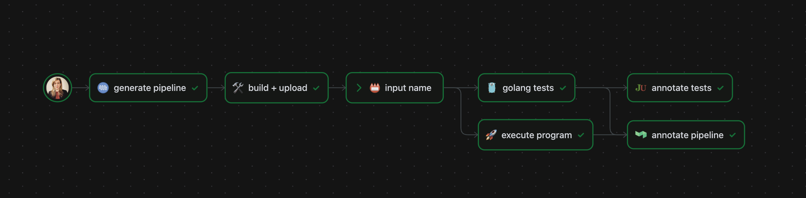

# 🚀 Go example project

[](https://buildkite.com/lelia/buildkite-pipeline-example) [](https://pkg.go.dev/golang.org/x/example)

This repository is a fork of the basic Golang example repo, trimmed down to contain a single example.

## 📦 Project setup

### 🛠️ Build the project

Please ensure you have `golang` v1.18+ installed before proceeding:

```bash
$ cd hello
$ go build
```

A simple application that takes a command line argument, and then returns it to you in a string:

```bash
$ chmod +x hello/hello
$ ./hello/hello John Doe
```

The above program will return `Hello, John Doe!`

### 🧪 Test the project

You can run unit tests for the application using `go test`:

```bash
$ cd hello
$ go test
```

### 🪁 Run the pipeline

The Buildkite pipeline for this project is available here: https://buildkite.com/lelia/buildkite-pipeline-example

The pipeline contents are generated from [pipeline.yml](.buildkite/pipeline.yml) and [preflight.yml](preflight/preflight.yml) using the [upload](preflight/upload) script.

### 🧩 Pipeline anatomy

The following [canvas visualization](https://buildkite.com/resources/blog/visualize-your-ci-cd-pipeline-on-a-canvas/) shows a top-level depiction of what's happening in the pipeline:



## ✨ Future enhancements

With additional time, the overall project and pipeline could be enhanced in the following ways:

* Incorporate Buildkite Test Analytics using the [Test Collector Plugin](https://github.com/buildkite-plugins/test-collector-buildkite-plugin) and AWS Secrets Manager
* Remove [Junit Annotate Plugin](https://github.com/buildkite-plugins/junit-annotate-buildkite-plugin) in favor of the above Buildkite Test Analytics configuration
* Expand pipeline annotations to summarize test results and provide build statistics
* Optimize AWS autoscaling policies and Elastic Stack configuration to reduce agent wait times
* Utilize Docker build caching to speed up downloads of `golang` images
* Add negative test cases and edge cases for the `hello.go` program focused on user input validation
